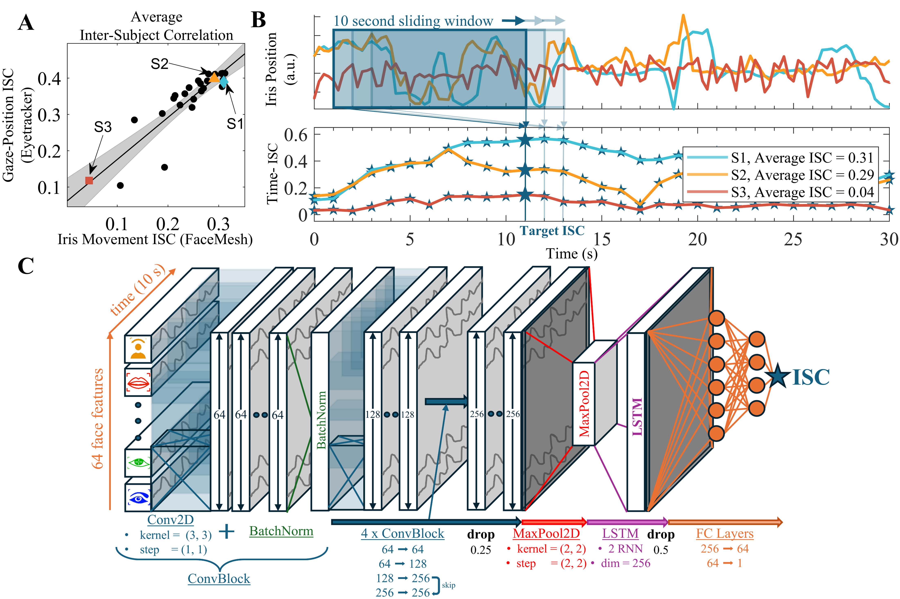

# timeISC
Pytorch implementation of Time-resolved Inter-Subject Correlation Prediction, see  *"Real-time estimation of overt attention from dynamic features of the face using deep-learning"*, arXiv link: https://arxiv.org/abs/2409.13084 

**Abstract:**

Students often drift in and out of focus during class. Effective teachers recognize this and re-engage them when necessary. With the shift to remote learning, teachers have lost the visual feedback needed to adapt to varying student engagement. We propose using readily available front-facing video to infer attention levels based on movements of the eyes, head, and face. We train a deep learning model to predict a measure of attention based on overt eye movements. Specifically, we measure Inter-Subject Correlation of eye movements in ten-second intervals while students watch the same educational videos. In 3 different experiments (N=83) we show that the trained model predicts this objective attention metric on unseen data with $R$²=0.38, and on unseen subjects with $R$²=0.26-0.30. The deep network relies mostly on a student's eye movements, but to some extent also on movements of the brows, cheeks, and head.  In contrast to Inter-Subject Correlation of the eyes, the model can estimate attentional engagement from individual students' movements without needing reference data from an attentive group. This enables a much broader set of online applications. The solution is lightweight and can operate on the client side, which mitigates some of the privacy concerns associated with online attention monitoring

If helpful, please cite: 

@misc{ortubay2024realtimeestimationovertattention,
      title={Real-time estimation of overt attention from dynamic features of the face using deep-learning}, 
      author={Aimar Silvan Ortubay and Lucas C. Parra and Jens Madsen},
      year={2024},
      eprint={2409.13084},
      archivePrefix={arXiv},
      primaryClass={cs.CV},
      url={https://arxiv.org/abs/2409.13084}, 
}
