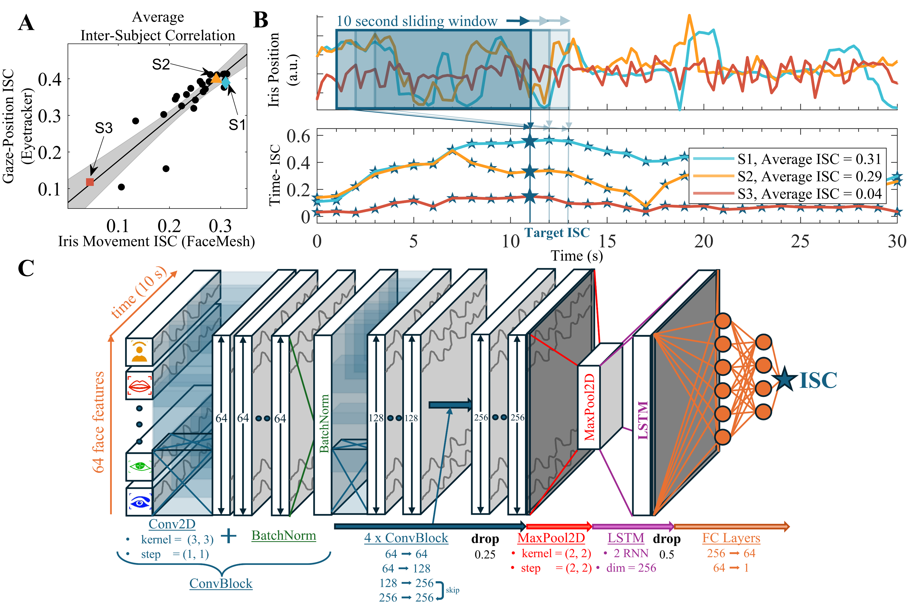

# timeISC
Pytorch implementation of Time-resolved Inter-Subject Correlation Prediction, see  *"Real-Time Estimation of Overt Attention from Dynamic Features of the Face Using Deep Learning"*, presented at the 2025 47th Annual International Conference of the IEEE Engineering in Medicine and Biology Society (EMBC) 

paper proceeding link: https://ieeexplore.ieee.org/abstract/document/11254013 

preprint link: https://arxiv.org/abs/2409.13084 

**Abstract:**

Students often drift in and out of focus during class. Effective teachers recognize this and re-engage them when necessary. With the shift to remote learning, teachers have lost the visual feedback needed to adapt to varying student engagement. Existing methods for measuring student attention often rely on manual checklists or subjective labels, making them labor-intensive and subjective. Meanwhile, prior research has shown that shared brain activity or gaze synchronization while attending to a common stimulus can reliably differentiate attentive students from those who are distracted. Here, we use Inter-Subject Correlation (ISC) of eye movements as an index of attention and train an AI to predict attention from a single subject’s facial dynamics alone. This removes the need for a reference group or human labeling of attention. In three different experiments (N=83), our deep neural model explained up to 38% of the variance (R²=0.38) for known-subject data and 26–30% (R²=0.26–0.30) for new subjects, capturing time-resolved overt attention. Furthermore, the estimated attention values correlated with post-video test scores (r=0.41-0.49), effectively capturing performance-relevant attention. A feature-ablation analysis revealed that eye and head movements most strongly drive the model’s predictions. The proposed method offers a novel scalable solution that is objective, does not require extensive human labeling, and is scalable to  real-time, privacy-preserving  engagement monitoring in remote education.

If helpful, please cite: 

@INPROCEEDINGS{11254013,
  author={Silvan, Aimar and Parra, Lucas C. and Madsen, Jens},
  booktitle={2025 47th Annual International Conference of the IEEE Engineering in Medicine and Biology Society (EMBC)}, 
  title={Real-Time Estimation of Overt Attention from Dynamic Features of the Face Using Deep Learning}, 
  year={2025},
  volume={},
  number={},
  pages={1-5},
  keywords={Deep learning;Visualization;Correlation;Webcams;Face recognition;Manuals;Predictive models;Real-time systems;Labeling;Monitoring},
  doi={10.1109/EMBC58623.2025.11254013}}
